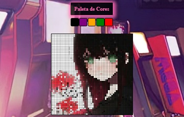

# Pixel Art

## Descrição

O Pixel Art é um aplicativo simples e divertido onde você pode expressar sua criatividade através de desenhos em estilo pixel. Nele, você pode desenhar livremente, ajustar o tamanho do quadro (board) para suas preferências e até mesmo fazer o upload de uma imagem que será desenhada no board em formato pixel art.

## Como Usar

Para utilizar o Pixel Art, basta abrir o arquivo `index.html` em seu navegador. A partir daí, você estará pronto para começar a desenhar e criar suas obras de arte pixeladas!

## Funcionalidades

- Desenhe livremente no quadro (board) para criar suas próprias imagens em estilo pixel art.
- Ajuste o tamanho do quadro para criar desenhos de diferentes dimensões.
- Faça o upload de uma imagem e veja-a sendo desenhada no quadro em formato pixel art.

## Tecnologias Utilizadas

O projeto foi desenvolvido utilizando as seguintes tecnologias:

- JavaScript
- HTML
- CSS
